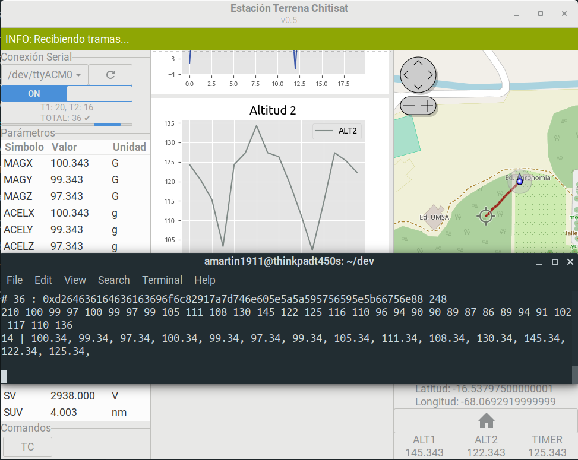

# Estación Terrena Chitisat (ETC)

*Estación Terrena Chitisat* (ETC), which literally translates to "*Chitisat* Ground Station", is a **CanSat-alike ground station software** developed for my undergraduate university final project. It's developed with [PyGObject](https://pygobject.readthedocs.io/en/latest/), a Python 3 package which provides bindings for GNOME's GIMP Toolkit, [GTK+ 3](https://www.gtk.org/). Next is a screenshoot of ETC's GUI running a simulation with some non-sense-but-structured incoming data.



ETC is part of the *Chitisat* project, a Bolivian didactic satellite similar to a CubeSat, but entirely framed in a typical CanSat mission. *Chitisat* is under construction at *Instituto de Electronica Aplicada* ([IEA](http://iea.umsa.bo/)), and haven't been launched to Earth's lower atmosphere yet. If you're interested in learning more about *Chitisat*, you can [take a look here](https://gitlab.com/amartin1911/teXisUMSA/blob/master/FCPN/informatica/pdf/tesis_online.pdf) (Go to Chapter 4. Spanish only).

ETC has been conceived to work only for the *Chitisat* CanSat. However, you can have a taste of its capabilities and play with the code by the means of an Arduino loaded with a simulation program that can send dull data to ETC software.

Please take into account for the time being **there is no such thing as a packaged or executable version of ETC**, so, you will have to setup the proper development environment including all the required dependencies.

### Prerequisites

##### Setup a proper Python 3 development environment

A functional Python development environment based on Git + pyenv + pipenv + GTK3 (PyGObject) is mandatory. Detailed instructions on how to setup this environment can be found [here](https://pygobject.readthedocs.io/en/latest/devguide/dev_environ.html).

##### Install OsmGpsMap system libraries
```bash
$ sudo apt update
$ sudo apt install libosmgpsmap-1.0-1
```

##### Find and setup the Arduino port

Arduino boards and other USB-serial devices end up recognized as `/dev/ttyACM*`  or `/dev/ttyUSB*` in your **Linux-based** host OS, for example, `/dev/ttyACM0`.

Communication between Arduino and PC doesn't work out of the box in Linux (as far as I'm concerned), so, a workaround is mandatory.

Next are steps for a **first-time only setup**. However, some of these commands might be useful if you  experiencing issues with the Arduino board connection.

###### On Linux
1. Open a terminal and type:
```bash
$ ls -l /dev/ttyACM*
```
With your board plugged in will tell you if it'd been recognized and what group(s) can access it. you should see and output similar to this:
```bash
crw-rw---- 1 root dialout 166, 0 oct 22 11:23 /dev/ttyACM0
```
Note the presence of ```root``` and ```dialout``` groups. So now it's time to add yourself to the ```dialout``` group.

2. Add ```$YOUR_USERNAME``` to the ```dialout``` group by typing:
```bash
$ sudo usermod -a -G dialout $YOUR_USERNAME
```

3. Logout and then log back.

4. Finally, open a terminal and run ```$ groups $YOUR_USERNAME``` and look for ```dialout``` in the output.  

**Note**: In case group change isn't recognized after the logout/log-back step, try rebooting the system.

###### On Windows

No special setup is required. Finding the port is really straightforward.

1. Open **Device Manager**, and expand the ```Ports (COM & LPT)``` list.


2. Finally, note the port number ( ```COM*```) of the Arduino board.

### Installation

Thanks to `pipenv` package, ETC and its dependencies installation is really straightforward.

```bash
$ git clone https://github.com/amartin1911/ETC
$ cd ETC
$ pipenv install
```

Aside from PyGObject, ETC is built upon well-documented libraries such as [Matplotlib](https://matplotlib.org/), [SQLAlchemy](https://www.sqlalchemy.org/), [Bitstring](https://pythonhosted.org/bitstring/), among others. The full dependencies list can be found on repo's Pipfiles.

### Use

On ETCs directory spawn the already installed `pipenv` environment. Finally run the app!

```bash
$ pipenv shell
$ python main.py
```

### Author

* **Alvaro Callejas** - *Initial work* - [amartin1911](https://github.com/amartin1911)

### License

This project is licensed under the GNU-GPLv3 License - see the [LICENSE.md](LICENSE.md) file for details

## Acknowledgments

* Philip Chimento, for his MVC pattern GTK implementation example.
